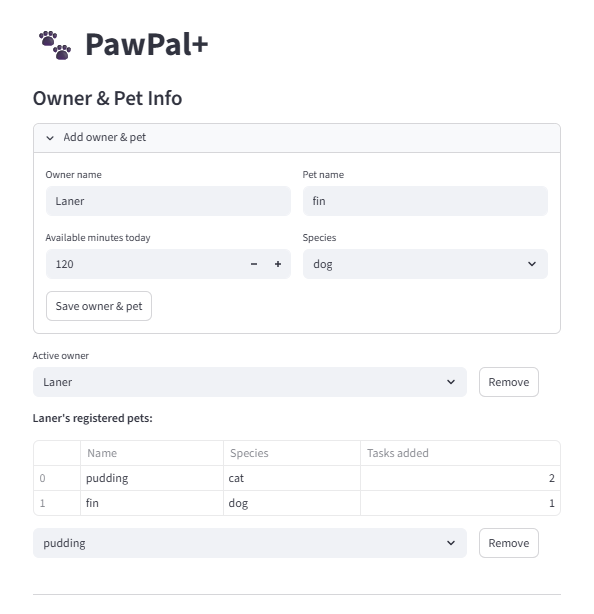
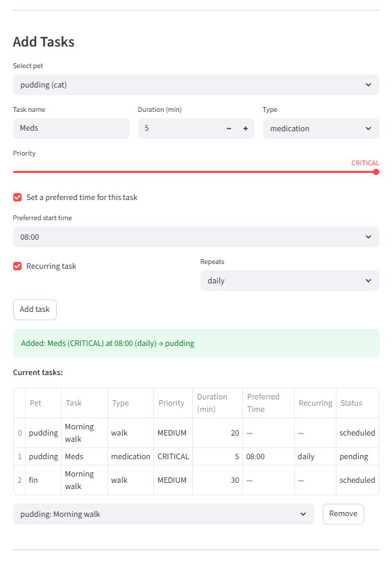
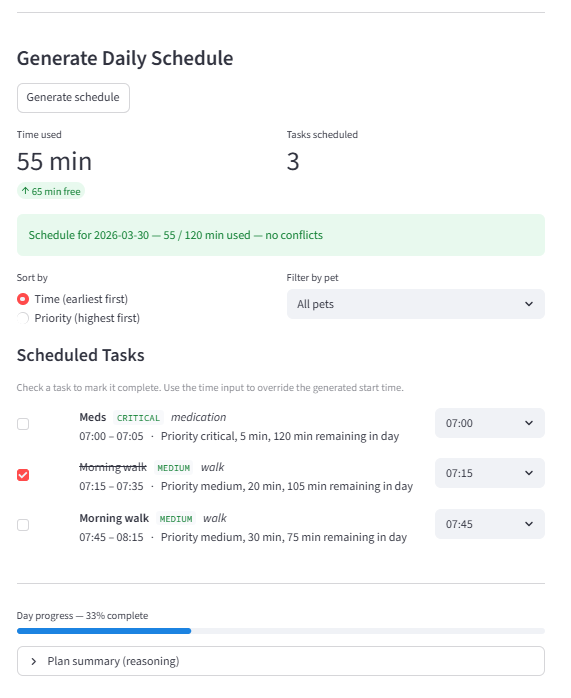
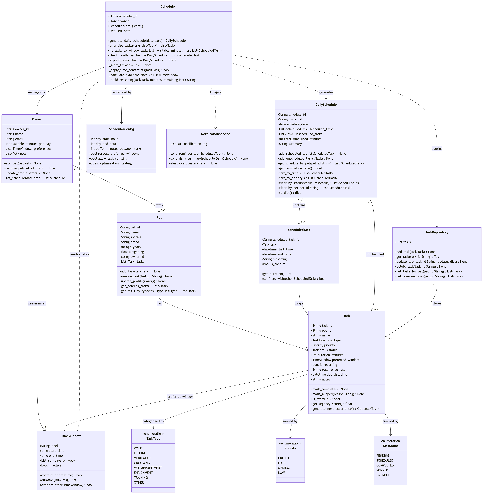

# PawPal+

A smart daily pet care scheduler built with Python and Streamlit. PawPal+ helps pet owners stay consistent with animal care by generating a prioritized daily plan, detecting schedule conflicts, and automatically queuing recurring tasks.

---

## 📸 Demo

<a href="projectImages/im1.png" target="_blank"></a>

<a href="projectImages/im2.png" target="_blank"></a>

<a href="projectImages/im3.png" target="_blank"></a>

---

## Features

### Priority-based scheduling
Tasks are ranked using a weighted urgency score before any time slots are assigned:
- Base score from priority level (CRITICAL = 4, HIGH = 3, MEDIUM = 2, LOW = 1)
- +10 bonus for overdue tasks — ensures missed care is always scheduled first
- +2 bonus for tasks due within 2 hours — escalates approaching deadlines automatically

### Greedy time-slot assignment
The scheduler places tasks into the day in urgency order using a single-pass greedy algorithm. It respects the owner's available-minutes budget, a configurable buffer between tasks (default 10 min), and the day's start/end hours. Tasks that don't fit are surfaced in a "Could Not Schedule" section rather than silently dropped.

### Conflict detection
After every render, `Scheduler.check_conflicts()` runs an O(n²) pairwise overlap check across all scheduled tasks. Conflicting tasks are flagged inline with a warning icon, and a banner tells the owner exactly which two tasks overlap, by how many minutes, and what time to move one of them to.

### Sorting controls
The schedule view can be sorted two ways without regenerating the plan:
- **By time** — earliest task first, using `DailySchedule.sort_by_time()`
- **By priority** — most critical task first, using `DailySchedule.sort_by_priority()`

### Pet filter
In multi-pet households, a dropdown filters the schedule to show only one animal's tasks using `DailySchedule.filter_by_pet()` — without discarding the rest of the schedule.

### Recurring tasks
Tasks can be set to repeat daily or weekly. When marked complete, `Task.generate_next_occurrence()` automatically creates a fresh pending copy with the next due date calculated via `timedelta`. A toast notification confirms the next instance was queued.

### Day progress tracking
A live progress bar and completion percentage update as tasks are checked off, using `DailySchedule.get_completion_rate()`.

### Manual time overrides
Each scheduled task has a time input that lets the owner adjust the generated start time without regenerating the whole plan. Conflicts are re-checked immediately after any override.

### Multi-owner support
Multiple owners can be registered in the same session. An "Active owner" selector scopes all sections — pets, tasks, and schedule — to the selected owner. Each owner maintains their own independent schedule.

### Remove owner, pet, or task
Owners, pets, and tasks can be deleted at any time. Removing an owner clears their schedule and switches the active owner to the next available one. Removing a pet or task invalidates the current schedule so it can be regenerated cleanly.

---

## Getting Started

```bash
python -m venv .venv
source .venv/bin/activate  # Windows: .venv\Scripts\activate
pip install -r requirements.txt
streamlit run app.py
```

---

## Project Structure

```
pawpal_system.py   — all data models, enums, and scheduler logic
app.py             — Streamlit UI
tests/
  test_pawpal.py   — 31 unit tests
umlDiagram.md      — Mermaid class diagram (final, matches implementation)
uml_final.png      — exported UML diagram image
main.py            — CLI demo script
```

---

## Testing

```bash
python -m pytest        # quick pass/fail summary
python -m pytest -v     # verbose — shows every test name and result
```

The test suite contains **31 tests** across 6 behavioral groups:

| Group | Tests | What it verifies |
|-------|-------|-----------------|
| **Urgency scoring** | 5 | Base priority scores, +10 overdue bonus, +2 near-deadline bonus, completed tasks don't get overdue bonus |
| **Task prioritization** | 3 | High-priority tasks sort before low, overdue low task outranks fresh critical, empty list handled safely |
| **Greedy scheduling** | 5 | Tasks fit within time budget, oversized tasks are skipped, 10-min buffer applied between tasks, edge case of exact-fit budget |
| **Conflict detection** | 5 | Non-overlapping tasks produce no conflicts, exact-same-time tasks both flagged, partial overlap flagged, adjacent tasks not conflicts, empty schedule handled |
| **Recurring tasks** | 6 | Daily rule creates task due tomorrow, weekly rule creates task due in 7 days, new task inherits all properties, non-recurring returns None, unknown rule returns None gracefully |
| **Sorting & filtering** | 5 | `sort_by_time()` returns chronological order, sort doesn't mutate original list, `sort_by_priority()` puts CRITICAL first, `filter_by_pet()` returns correct subset, unknown pet returns empty list |

**Confidence: 4 / 5** — all 31 tests pass covering core scheduling logic end-to-end. Gap: no automated tests for the Streamlit UI layer.

---

## System Design
UML Mermaid.js Class Diagram

<a href="projectImages/uml_final_.png" target="_blank"></a>
